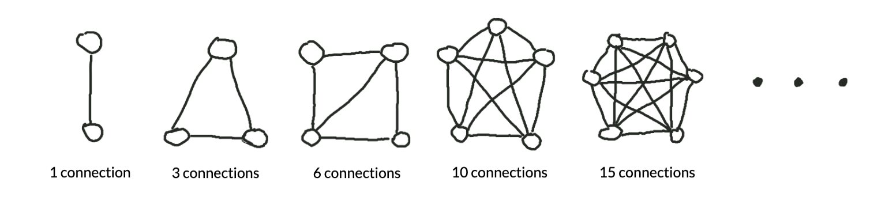
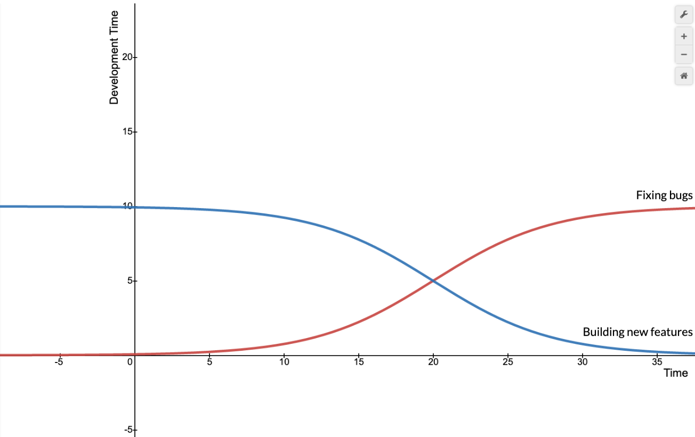

In the process of starting a startup -- and writing code to make it work -- I've read a lot of advice. Thanks to the internet, we can now access everything from Medium articles introducing unit testing in JavaScript to full-length lectures about microservices at Netflix, for free! Some of the advice is great, some of it is outright wrong, and all of it broadened my perspective, but most of it was just irrelevant to a person in my position.

At a startup, the rapid pace of growth demands that every team member learns quickly, including the software engineers. As a result, in the whirlwind of the past year, I've encountered countless new companies, technologies, and ideas. More importantly, I've learned a few lessons about prioritization, in an environment where there's never enough time or money and always too much to do. 

While I don't hope to provide all the answers to building technology at a startup, I would like to share some of the lessons I've learned in the past year. Most importantly, I hope to spark a conversation on the best way to approach software at an early-stage startup, and on taking that software to scale. 

The best measure of a great new technology is that it becomes boring quickly. Like, duh, who *wouldn't* use a radiation chamber to heat their Hot Pockets faster!

To get to the point of being boring, technology has to be reliable enough that people can take it for granted, and make it a part of their daily lives. When it comes to software, reliability doesn't just improve the user experience -- with the right principles in mind, writing reliable code speeds up the development process. This way, we can spend less time fixing bugs, and more time creating awesome new experiences for our users.

# Setting the scene

## Monoliths and Waterfall Development

Writing software used to be a lot like baking a sponge cake. You could combine all the ingredients into a gooey batter -- printer drivers, font families, image processing tools, and so on -- and bake the cake in one fell swoop. Once it was done, you'd have a finished software product -- say, Microsoft Word 1.0.

A sponge cake is a <ins>monolith</ins>: a single, coherent piece of software that contains many sets of features.

The idea of baking the cake all at once is called <ins>waterfall development</ins>: where a team spends a long time (usually months to years) creating one big product release, with lots of new features all at once. After the first version of the software is released, the team starts working on v2.0, which is so different from v1.0 that it's basically a whole new cake.

Like most (reasonable) people, I enjoy eating cake. But software is not the same as food (despite the deceptively named Android Jelly Bean operating system). 

The difference? Software is consumed as it's made. These days, a Facebook engineer (let's call her Amanda) can add a new set of emoji reactions on Wednesday morning, and users will be using them to respond to stock market memes on Facebook by Wednesday afternoon. 

## Service-oriented architecture

As a whole, software companies no longer practice the cake-baking, waterfall model of software development. Modern internet software is more like guacamole: a combination of disparate features -- called <ins>services</ins> -- that are loosely linked to form a coherent user experience. For example, Spotify has one service for playlists, one service for search suggestions, and thousands of others handling every part of the user experience and behind-the-scenes logic. 

The difference between cake and guac is huge: while old software took months to bake, modern software is ready to go right away. When Amanda adds a sticker pack to Facebook Messenger, regular people can start using it almost immediately. (Another difference between cake and guac is that only one of them goes well with quesadillas, but that's beside the point).

A software composed of services is using <ins>service-oriented architecture</ins>.

With this model, teams iterate quickly, so they can continuously deliver new features to customers and get feedback on those changes -- this process of rapid iteration is the foundation of <ins>Agile software development</ins>, an alternative to the waterfall model.

## Where we are now

Nearly every notable software company now uses the Agile development process. Meanwhile, service-oriented architecture is still relatively new. Much like how Takeru Kobayashi popularized the method of separating buns from sausages to dominate hot-dog eating competitions, companies like Spotify and Netflix are just starting to demonstrate the potential of this approach. 

And it makes sense. Let's say you want to add a new feature to your product. In our food analogy, a feature is like an ingredient: is it easier to mix tomatoes into your guac or mix tomatoes into your sponge cake? In the same way, it's generally much easier to add new features to a service-oriented architecture, when each piece of the app acts independently of the others. Otherwise, you'll end up with some very soggy cake. 

Service-oriented architecture also allows the developer to choose which services to implement in-house, and which ones to borrow from third-party providers. As a company, outsourcing standard functions like error reporting and customer management systems to other companies lets us focus on what truly makes us different. 

If they're so great, why isn't everyone using service-oriented architectures already? Do software companies just love serving soggy cake?

There's one major barrier to adoption for service-oriented architectures: it's hard to make the services interact correctly with each other. Having more services means having more connections and more moving parts that could break. 

Fortunately, though, the food analogy comes in handy again: if we want to make sure the ingredients of our guacamole go well together, each and every time, we'll need a <ins>recipe</ins>. 

One recipe for reliable service-oriented development, coming right up!

# Goals

In this guide, we're looking to optimize the following metrics:
- Development speed

Oh, looks like that's it! First, here's a quick definition:
> <ins>Development speed</ins> is the rate at which a company develops valuable features for customers. 

Not every company cares about moving fast. But reliability and speed do not stand at odds with each other -- in fact, as we'll see in a second, reliable code is often easier to revise and improve quickly. 

# Avoiding Technical Debt

So we want to optimize development speed. Great! 

At the beginning, it's really exhilirating to develop lots of new features really fast. Move fast and break things, right? But if you completely disregard code quality, your software will likely start to look like this:

Why? Because, the more complicated a software is, the more components it has that could go wrong. If your program is deeply coupled, that is, if every module depends on every other module, you end up exponentially increasing the chance of something going wrong at the connections between the parts. 

Mathematically speaking, if we let the number of modules equal *n*, the number of connections in the system is equal to the sum of the integers from 1 to n-1. For example, for a piece of software with 5 modules, the total number of connections is 1 + 2 + 3 + 4 = 10 connections.

Another way to get the same result is to evalute n(n-1)/2. As an example, for n=5, (5 * 4) / 2 = 10 connections. In other words, the number of connections depends on the **square** of the number of modules -- if the number of connections is proportional to the number of things that can go wrong, then the potential bugginess of the program increases quadratically with the number of modules!

Even if not every piece of your software is connected to all the others, this math demonstrates how the number of connections in a program scales **superlinearly** with the number of modules it has. This sucks, because it means your time will start to look like this:

Anyone familiar with <ins>technical debt</ins> has likely seen these graphs before. But what does this mean in a service-oriented context? How do we still optimize developer time by making our software sustainable, reliable, and maintainable?

# A 3-Tier Model 

Our strategy for developing reliable software requires 3 components:

1. Testing
2. Automated error tracking
3. Customer support
  
Each level gets closer to the customer, and gets accordingly less scalable (testing can preemptively solve a lot of problems, whereas solving a customer support case might only address one).

While these levels are not unique to the service-oriented world, I will focus here on what they mean in the context of services.

We'll tackle these components one by one, then see how they fit together to create reliable production software.

## 1. Testing

Remember this picture from earlier?

With a service-oriented architecture, this kind of complexity is inevitable. Each individual service -- each node on the graph -- is very simple. The complexity lies in the connections. As we saw earlier, the more complex something is, the more likely it is to break!

As a result, with service-oriented architectures, it's most important to test the <ins>connections</ins> between the services, rather than the services themselves. Of course, it wouldn't hurt to have tests verifying that every little unit of code works, but remember that our developers don't have all day to write pretty-looking test cases -- we need time to ship working code to customers, and to enjoy some of the amazing free snacks stocked in the office snack bar.

Testing to optimize developer time in a service-oriented architecture means **focusing on integration tests** that cover your app's use cases -- for Facebook, this would include actions like signing up for an account, sending a message on Messenger, or commenting on a friend's post. 

Prioritize testing for the features that are likely to break and are critical to your user experiences, or for the bugs that you're not likely to notice immediately. That last bit feels a bit counterintuitive at first, so here's an example: if your login page is broken, you'll probably notice right away, but it might take weeks before you discover a bug with the forgot password feature -- because no one remembered to manually test it! That's a place where automated testing would have really helped.

In fact, it might be useful to cover your entire app's functionality with end-to-end tests, so you can at least be sure that your major features work properly as you ship code to production. 

One caveat: testing does slow down your development process at first. Aside from writing the tests themselves, you'll likely be allocating separate resources (databases, API endpoints, etc.) in a staging environment for testing, to mimic the production environment. In the long run, though, separating development, staging, and production environments is a useful habit, since it makes sure that nothing you do locally breaks the production software. 

Compared to integration tests, unit tests for services are a lot more painful, since you have so many services to mock out. However, it can speed up debugging (and even development) time to start with unit tests for the especially complicated pieces of code, and to move towards full unit test coverage later on. 

Making automated integration tests part of a continuous integration (CI) pipeline will probably save you a lot of time and stress.

## 2. Automated error tracking

Assuming your testing didn't catch 100% of your errors (which it never seems to do), you'll have some sneaky bugs leak into production.

This is an especially common problem with client-side websites, because people use 2 gazillion different browsers with varying levels of support for new features, and we all know that one person who's still using Internet Explorer.

Another cause of production errors is when -- shockingly -- a user does something differently than you expected. One example would be a text box that breaks when someone types an emoji in. However good your tests are, there will always be cases you didn't account for. 

Our goal is usually to notice problems before the users do, which means setting up an error tracking software to automatically report when errors occur in production.

With these two main causes in mind (browser compatibility and edge cases), our production error tracking software has two simple requirements: it needs to report the user's browser, device, and (ideally) identity, and it needs to enrich errors with custom context -- like, for example, the text you were typing into that emoji-unfriendly textbox when it suddenly decided to break. These requirements are the same regardless of whether your app is a nutrition tracker or Instagram for dogs. 

WHen a feature is not unique to your app's main purpose, you might consider using an external service. Bug tracking platforms like Sentry and Bugsnag are getting better every day, and are relatively simple to set up.

One caveat: bug tracking softwares can be pricey, so you'll have to weigh the benefits of production bug detection with the material cost of the service. Compared to integration testing, bug reporting in a service-oriented architecture is more important at a larger scale, where there are many more edge cases and strange browsers to contend with. 

Ultimately, an effective bug-tracking strategy lets you find and fix production errors before your users even notice -- and before they start complaining. Just as important, it saves you time debugging customer bug reports, because you already know the context of the issue at hand. But nothing ever works perfectly, and that's when people complain:

## 3. Customer support

Working closely with customers is critical for improving the usability of your software and creating customer loyalty. At the same time, though, addressing customer complaints can become a serious drag on productivity. Sometimes customer bug reports are useful and reproducible; other times, they only exist in a narrow edge case that 0 other people in your user base are experiencing, and it's not worth spending 99% of your time fixing a problem that only 1% of your users are facing. 

The hardest part of customer support is that you don't know which reports are actually useful. Still, though, it's important to at least read customer bug reports, because they serve as a last-resort method for catching the bugs you missed in testing and error reporting. 

In a service-oriented world, the dynamics of customer service don't change much, but the way communication is implemented does. Services like Intercom can help you maximize your customer support efficiency, by directing common questions to a custom knowledge base and providing a streamlined interface for responding to customer questions and comments.

# Wrapping Up

In my experience, testing, bug tracking, and customer support (with regards to bug reports, not product or business-related feedback) should generally be prioritized in that order. Because each level is less scalable, setting the right priorities lets developers focus on writing integration tests that make sure the software works reliably at scale.

In a service-oriented environment, bug tracking and customer support can be outsourced effectively to third-party services, freeing developers to work on the features that make your business stand out. Of course, this article only covers reliability, which is  one of the many unique challenges and opportunities we face when building services for production software. Because it's written from the perspective of a startup founder, my advice focuses on small to mid-scale operations, with none of the complexity of giants like Netflix or Spotify. 

Reliable service-oriented software is more than possible, if we can just perfect the recipe.